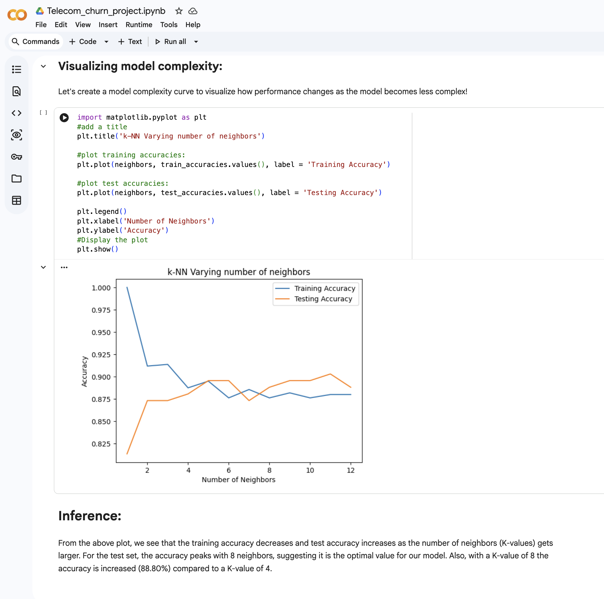

# Telecom Churn Prediction

## Overview
This project focuses on predicting customer churn in the telecom industry using machine learning and data analysis techniques.

## Problem Statement
Customer churn is one of the major challenges in the telecom industry. The objective of this project is to analyze customer behavior and build a machine learning model that predicts whether a customer is likely to leave the service.

## Dataset Link
https://www.kaggle.com/datasets/pratikshapagar2216/churn-bigml-20

## Technologies Used
- Python
- Pandas
- NumPy
- Matplotlib
- Seaborn
- Scikit-learn
- Jupyter Notebook

## Features
- Data preprocessing and cleaning
- Exploratory Data Analysis (EDA)
- Customer behavior analysis
- Churn prediction model
- Model training and evaluation
- Data visualization

## Machine Learning Concepts
- Classification
- Supervised Learning
- Feature engineering
- Model evaluation
- Prediction analysis

## Results
The project successfully identified patterns related to customer churn and generated predictive insights using machine learning techniques.

Evaluation metrics used:
- Accuracy Score
- Confusion Matrix
- Classification Metrics

## Output Screenshots

### Churn Analysis Visualization

## How to Run
1. Clone the repository
2. Install required dependencies
3. Open notebook in Jupyter Notebook or Google Colab
4. Run all cells

## Future Improvements
- Improve prediction accuracy using advanced models
- Deploy model using Flask or Streamlit
- Add dashboard visualization

## Author
Rutvi Patel
